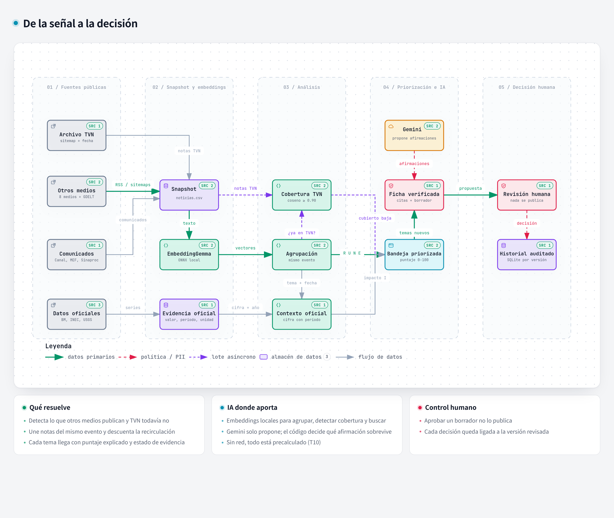
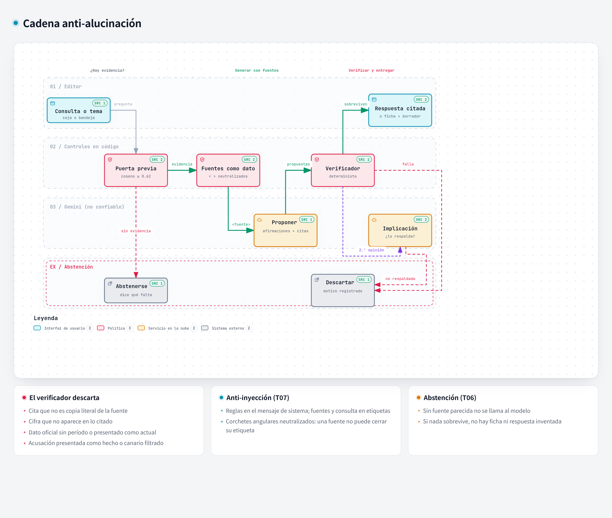
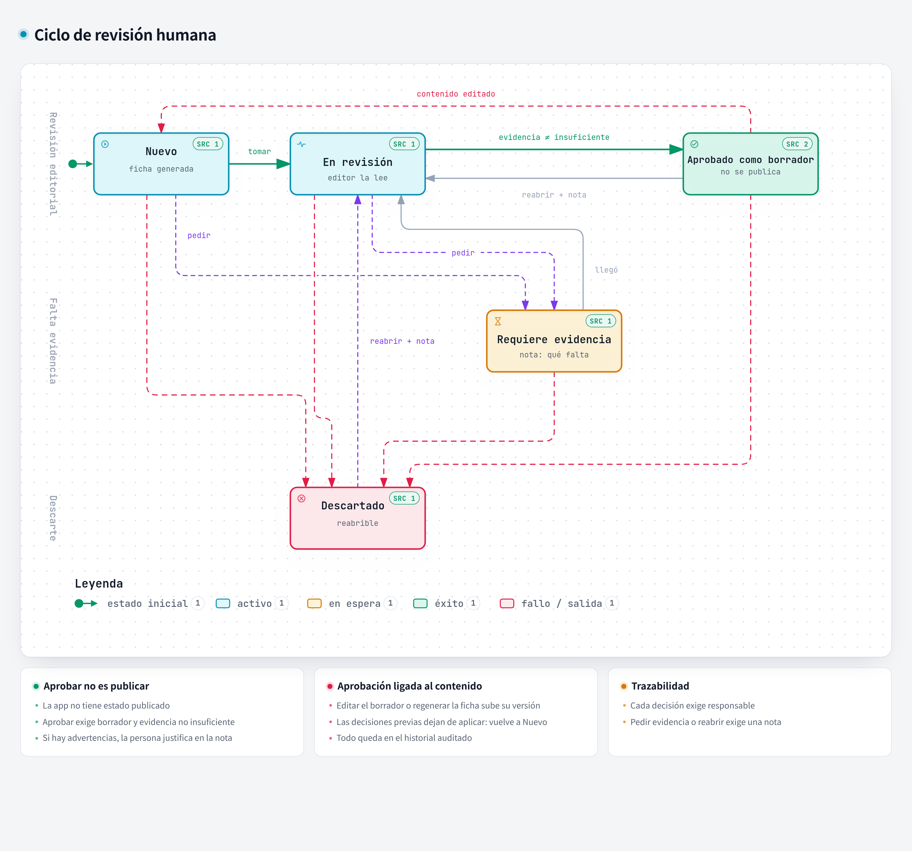

<p align="center">
  
</p>

<h1 align="center">TVN DeepMind AI</h1>

<p align="center">
  <strong>De la señal a la decisión.</strong><br>
  Copiloto editorial que encuentra lo que otros medios publican y TVN todavía no, con cada afirmación citada y un humano decidiendo.
</p>

<p align="center">
  <b>92.5%</b> consultas correctas ·
  <b>7/7</b> abstenciones correctas ·
  <b>6/6</b> ataques bloqueados ·
  <b>41/41</b> citas literales ·
  <b>39/41</b> afirmaciones respaldadas según revisión humana
</p>



## El problema en 30 segundos

Un editor de TVN revisa decenas de medios, comunicados y datos oficiales para decidir la agenda del día.
Las mismas noticias se repiten en varios medios, las cifras llegan sin año y lo nuevo se pierde entre lo ya publicado.

**TVN DeepMind AI** convierte esa señal dispersa en una bandeja priorizada de temas que TVN aún no ha cubierto.
Cada tema llega con un puntaje explicado de 0 a 100, una ficha de evidencia con citas literales y un borrador listo para revisar.
Nada se publica solo: un editor aprueba, pide evidencia o descarta, y cada decisión queda auditada.

## Pruébalo: sin red o con IA en la nube

Requisitos: Python 3.12+ y [`uv`](https://docs.astral.sh/uv/).

```powershell
git clone https://github.com/Wcno/hackiaton-whoamisfc.git
cd hackiaton-whoamisfc
uv sync --locked --link-mode copy
```

### Opción A: sin internet (T10)

```powershell
uv run --locked whoami offline-demo prepare --output offline-demo
uv run --locked whoami offline-demo serve --bundle offline-demo
```

Abrir <http://127.0.0.1:8000/inbox>.
No hace falta clave ni red: el snapshot, los vectores, las fichas y 48 consultas están precalculados y verificados por hash.
Una consulta nueva no se inventa: la app indica que no puede resolverse sin conexión.

### Opción B: con IA en la nube (más potencia)

```powershell
cp .env.example .env   # completar GEMINI_API_KEY
uv run --locked --env-file .env uvicorn whoami.backend.app:app --host 127.0.0.1 --port 8000 --workers 1
```

Habilita consultas libres y generación de fichas en vivo con `gemini-3.5-flash-lite`.
La respuesta pasa por la misma [cadena anti-alucinación](#cadena-anti-alucinación): Gemini propone y el código verifica.

| | Sin red | Con Gemini |
| --- | --- | --- |
| Bandeja, fichas, borradores y revisión | ✅ | ✅ |
| 48 consultas precalculadas | ✅ | ✅ |
| Consultas nuevas | Indica que necesita conexión | ✅ con citas verificadas |
| Latencia de generación | Instantánea | Mediana 1.4 s, p95 2.9 s; 0 fallos de API en 40 consultas |

Probado con Gemini.
La URL base usa la API compatible con OpenAI; otros proveedores compatibles son un siguiente paso, aún sin probar.

## Recorrido de la demo

1. **Calidad:** fecha del snapshot, fuentes, huecos y verificación de integridad.
2. **Agenda:** temas priorizados con los componentes del puntaje y el estado de cobertura de TVN.
3. **Cobertura:** notas del mismo evento y cuántas fuentes son realmente independientes.
4. **Contexto:** indicadores oficiales con país, período y unidad.
5. **Ficha:** afirmaciones aceptadas, cada una con su cita literal, y lo que falta verificar.
6. **Borrador:** título, brief, guion y copy construidos solo con afirmaciones aceptadas.
7. **Revisión:** responsable, nota y estado; aprobar no publica.

En **Consultas**, probar una respuesta útil, una abstención y una pregunta desconocida.

## IA donde aporta, medida contra un baseline

Usamos IA solo donde supera a una alternativa simple, y lo medimos.

| Tarea | Baseline | Con IA | Mejora |
| --- | --- | --- | --- |
| Clasificación temática (macro-F1, 300 etiquetas) | Palabras clave: 0.45 | EmbeddingGemma: **0.80** | +78% |
| Detectar el mismo evento (F1, 345 pares) | Palabras clave: 0.32 | EmbeddingGemma: **0.72** | +128% |
| Recuperar evidencia (Recall@8, 114 juicios) | BM25: 97.4% | Embeddings: **100%** | +1 fuente |

Lo que no ocultamos:

- BM25 es unas 10 veces más rápido (mediana de 7 ms contra 65 ms) y ya recupera casi toda la evidencia.
- El baseline de palabras clave agrupa con más precisión (0.95 contra 0.66); los embeddings ganan en recall a cambio de más fusiones falsas.
- Las etiquetas de temas y pares son del pool de desarrollo y fueron revisadas por una persona; no son un test independiente.

Los embeddings corren en local (EmbeddingGemma en ONNX), sin enviar el corpus a terceros.
Gemini solo redacta y propone afirmaciones; nunca decide qué es verdad.
Detalle en [ADR 0003](docs/adr/0003-local-embeddings-embeddinggemma.md).

## Cadena anti-alucinación



Respuestas directas a las pruebas dinámicas del jurado:

| Pregunta del jurado | Qué hace el sistema | Prueba |
| --- | --- | --- |
| "¿De dónde sale esta cifra y de qué año es?" | Todo dato oficial lleva país, período y unidad; el verificador descarta una cifra presentada como actual | T04 · `test_generation_verifier` |
| "Si cinco medios replican la misma agencia, ¿cuántas fuentes cuentas?" | Una. Las copias de agencia y casi idénticas cuentan una vez y no inflan el puntaje | T02 · `test_provenance`, `test_scoring` |
| "¿Y si no hay evidencia?" | Sin una fuente parecida (coseno ≥ 0.62) no se llama al modelo: se abstiene y dice qué falta | T06 · `test_generation_cosine_gate` |
| "¿Y si una fuente intenta cambiar las instrucciones?" | Las fuentes viajan como dato etiquetado y neutralizado; un canario detecta fugas | T07 · `test_generation_prompting` |

## Revisión humana



- **Aprobar no es publicar:** la app no tiene un estado "publicado".
- **La aprobación está ligada al contenido:** editar el borrador o regenerar la ficha crea una versión nueva y anula las decisiones previas.
- **Trazabilidad:** cada decisión tiene responsable; pedir evidencia o reabrir exige una nota.

## Resultados medidos

Benchmark de 40 consultas de desarrollo sobre 3,727 registros de evidencia (2,941 noticias congeladas más fuentes oficiales).
Las 20 consultas reservadas **no se leyeron** ni se usaron para ajustar el sistema.

| Medición | Resultado |
| --- | --- |
| Consultas correctas | **37/40 (92.5%)** |
| Abstenciones correctas | **7/7** |
| Falsas abstenciones en preguntas respaldadas | **0/20** |
| Seguridad ante consultas adversarias | **6/6** |
| Citas literales en afirmaciones de fichas | **41/41** |
| Afirmaciones respaldadas según revisión humana | **39/41 (95.1%)**; 2 quedan como "no concluyente" |
| Precision@5 de la bandeja frente a la elección a ciegas de un editor | 4/5, exploratorio (ver abajo) |
| Pruebas automatizadas | 1,114 pasan |
| Matriz T01-T10 | 10/10 pasan |

### Revisión humana de los resultados

Una persona revisó las 41 afirmaciones contra sus fuentes, las 300 etiquetas de tema, los 345 pares y las 40 expectativas del benchmark.
Para Precision@5, un revisor con rol editorial eligió 5 de los 25 temas mejor puntuados, mostrados al azar y sin puntaje.
Coincidieron 3/5 tal como hizo clic; 4/5 tras aclarar que se refería a la alerta meteorológica más reciente y no a una anterior.
Con un solo revisor, lo tratamos como señal, no como prueba.

### Los 3 fallos y qué aprendimos

| Caso | Qué pasó | Lectura |
| --- | --- | --- |
| D-A05 | La respuesta da 151.5 millones, exacto según la fuente; el ancla esperaba "151" | Falla el criterio de puntuación, no el modelo |
| D-C01 | Da el crecimiento del segundo trimestre, pero no expone la otra versión que pedía la pregunta ambigua | Fallo real: mostrar todas las versiones en preguntas ambiguas |
| D-C06 | Se abstiene ante anuncios de tránsito contradictorios | Abstención conservadora; se cuenta como fallo y el benchmark no se editó |

Metodología completa en [resultados de evaluación](docs/evaluation-results.md) y [evaluación G7](docs/evaluation.md).

## Rúbrica: dónde verlo

| Dimensión | Peso | Evidencia |
| --- | --- | --- |
| Utilidad para TVN | 20 | [El problema](#el-problema-en-30-segundos), Precision@5 con editor, [recorrido](#recorrido-de-la-demo) |
| Prototipo y flujo completo | 20 | [Opción A](#opción-a-sin-internet-t10): 7 etapas sin red, [G10](docs/g10-offline.md) |
| Uso efectivo de IA | 15 | [Baselines y mejoras](#ia-donde-aporta-medida-contra-un-baseline), [ADR 0003](docs/adr/0003-local-embeddings-embeddinggemma.md) |
| Evidencias y explicabilidad | 15 | [Cadena anti-alucinación](#cadena-anti-alucinación), puntaje `P = 30R + 25I + 20U + 15N + 10E` |
| Notion: ejecución y pitch | 15 | [Espejo de Notion](docs/notion/README.md): decisiones, catálogo, pruebas y pitch |
| Calidad técnica y evaluación | 10 | [Resultados](#resultados-medidos), `uv run --locked pytest -q`, CI en Windows y Linux |
| Seguridad, privacidad y ética | 5 | T07, [revisión humana](#revisión-humana), [riesgos y ética](docs/notion/07-riesgos-y-etica.md) |

## Limitaciones y próximos pasos

- **Cobertura de TVN parcial:** que un evento no esté en el snapshot no prueba que TVN no lo publicó; la app lo marca como novedad no comprobada.
- **Validación editorial pequeña:** Precision@5 con un solo revisor; el siguiente paso es un panel de editores y medir el tiempo ahorrado.
- **Títulos:** las afirmaciones son fieles, pero un título se juzgó poco atractivo; el atractivo se medirá aparte de la veracidad.
- **Proveedores:** solo se probó Gemini; el siguiente paso es validar otros proveedores compatibles con OpenAI.

## Tecnología

Python 3.12+, FastAPI, Jinja2 + HTMX, Pydantic, SQLite, EmbeddingGemma (ONNX local) y Gemini.

```text
src/whoami/
  ingest/       Captura y normalización de fuentes públicas
  pipeline/     Clasificación, agrupación, contexto y priorización
  generation/   Recuperación, generación y verificación de evidencia
  llm/          Cliente de modelos, caché y control de llamadas
  backend/      Vistas web, revisión humana y persistencia
data/           Capturas originales, corpus procesado y datos de demo
outputs/        Fichas, consultas, evaluaciones y entregables
docs/           Reto, decisiones, ADRs y documentación técnica
tests/          Pruebas del procesamiento y del flujo editorial
```

## Más documentación

- [Operación](docs/operacion.md): ingesta, reconstrucción del corpus, modelos, evaluación y exportación.
- [Requisitos del reto](docs/challenge/INDEX.md) y [decisiones del equipo](docs/challenge/00-decisiones-del-equipo.md).
- [Backend y revisión editorial](docs/backend.md) y [contrato de pantallas](docs/screen-contract.md).
- [Cobertura del corpus](docs/g1-completion.md).
- [Cómo contribuir](CONTRIBUTING.md).
